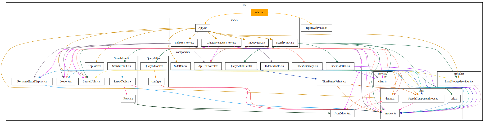

[](https://npmjs.org/package/ts_dependency_graph)


# TS-Dependency-Graph

Prints a dependency graph in dot format for your typescript or react project. Supported files are .ts and .tsx.
Supports tsconfig path mappings since v1.4.0.

### Usage

#### Install CLI

`npm i ts_dependency_graph -g`

```
 ts_dependency_graph --help
Options:
  --help                          Show help                            [boolean]
  --version                       Show version number                  [boolean]
  --color_edges                   use a random color to color the edges, group
                                  by node.             [boolean] [default: true]
  --start                         the starting file, for the analysis. can also
                                  be a folder or a glob for multiple starting
                                  files.                     [string] [required]
  --graph_folder, --graphfolders  groups files in their folder in the graph
                                                      [boolean] [default: false]
  --aggregate_by_folder, --agg    create graph on folder level
                                                      [boolean] [default: false]
  --max_depth                                           [number] [default: 1000]
  --filter                        removes files containing the provided
                                  strings. Can be negated with - in front, to
                                  remove files not containing the filter. e.g.
                                  'NOT module1' - everything not containing
                                  module1.ts will be filtered.
                                                           [array] [default: []]
  --filter_edges                  Experimental. removes edges containing the
                                  provided strings, the format is
                                  start_file=>target_file. The edges containing
                                  start_file AND target_file are removed. Start
                                  and target can be negated with 'NOT ' in front
                                  . (Currently) This is not just a postprocess
                                  on the graph. The edges won't be followed.
                                  Note: put in quotes.     [array] [default: []]
  --verbose, -v                   prints information about ignored files
                                                      [boolean] [default: false]
  --verbose_filter                prints information about filtered files and
                                  edges               [boolean] [default: false]
  --hotspots, -h                  identify hotspots, by analyzing number of
                                  incoming and outgoing edges
                                                      [boolean] [default: false]
  --base_path                     calculates path relatives to the base path
    [string] [default: "/home/pascal/LinuxData/Development/ts-dependency-graph"]
  --show_path_to                  will display the shortest paths between start
                                  and show_path_to                      [string]

```

`ts_dependency_graph --start src/index.ts`

Use output with https://stamm-wilbrandt.de/GraphvizFiddle/#, https://dreampuf.github.io/GraphvizOnline/, http://www.webgraphviz.com/, or by piping result to dot tool


```
ts_dependency_graph --start src/index.ts --graph_folder | dot -T svg > dependencygraph.svg
```


#### Real Worl Example

Usage on (quickwit-ui)[https://github.com/quickwit-oss/quickwit/tree/93097687060b89c2fa5e1668f158036574355938/quickwit-ui]

```
ts_dependency_graph --start src/index.tsx --graph_folder | dot -T svg > dependencygraph.svg
```



#### Use from Github Repo

`npx ts-node src/index.ts --help`


